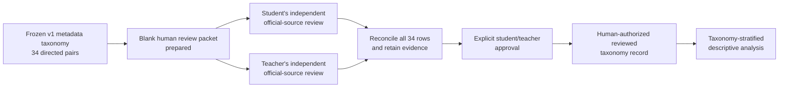

# Taxonomy dependency map

## Current state

The 34-pair Method Code taxonomy is frozen as a metadata-only proposal, not a
reviewed factual classification. The human-review packet is ready, but every
row is still pending. No taxonomy-stratified analysis has run.

## Gates and ownership

| Gate | Status | Required owner | Blocking condition |
| --- | --- | --- | --- |
| Frozen input inventory | Complete | Repository record | Exact 34-pair coverage and source hash |
| Unreviewed handoff packet | Complete | Repository record | Blank template has no auto-confirmed decision |
| Official-source verification | Human-blocked | Student and teacher | Every pair needs source-specific evidence |
| Discrepancy reconciliation | Human-blocked | Student and teacher | No unresolved or conflicting row |
| Explicit stratification authorization | Human-blocked | Student and teacher | Written confirmation after full review |
| Taxonomy-stratified analysis | Blocked | Project team | All preceding human gates must pass |

## Non-bypass rules

- Do not infer a completed review from a source URL, a script check, or a
  proposed class already present in the frozen input.
- Do not read, use, or add effect estimates, residuals, tiers, labels, scores,
  thresholds, or rankings to decide a taxonomy row.
- Do not change the frozen v1 table's pending status to simulate review.
  A future reviewed record must be separately human-authorized and preserve its
  source evidence.
- No physical instrument-change, real-AQS, causal, or measurement-bias claim
  follows from this taxonomy, whether or not all rows are eventually reviewed.

## Work that remains independent

The v0.4 theoretical bounds, frozen-result provenance, core metric audit,
stress-suite audit, novelty audit, claim/evidence crosswalk, and preliminary
manuscript/figure architecture may proceed under their own gates. They may not
use taxonomy-stratified results or state taxonomy-dependent conclusions before
the human gates above are complete.
